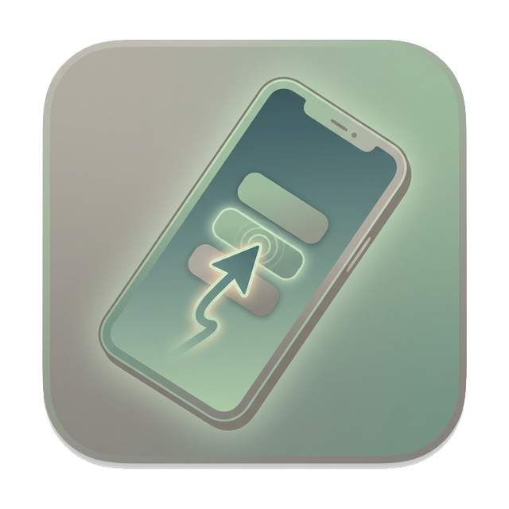
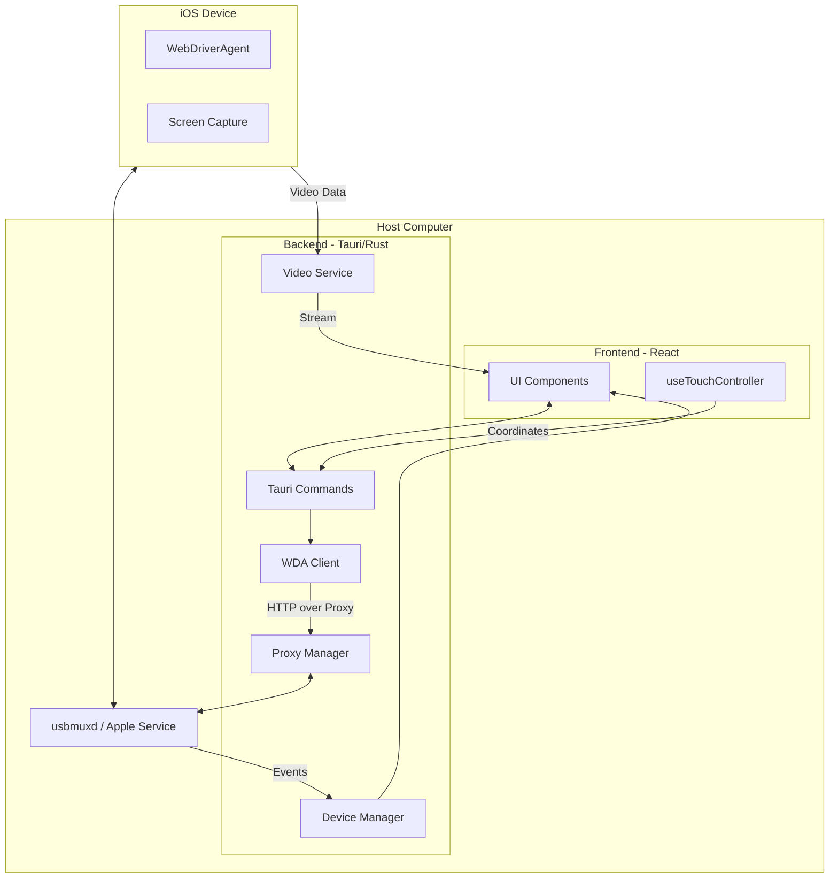
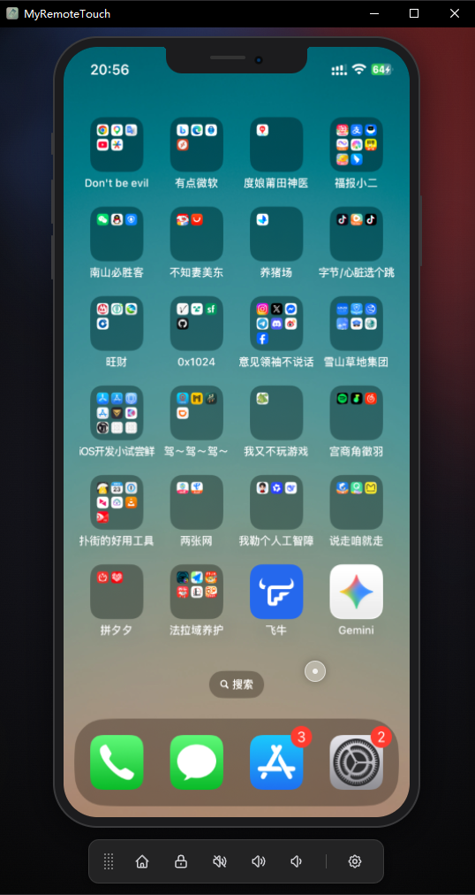
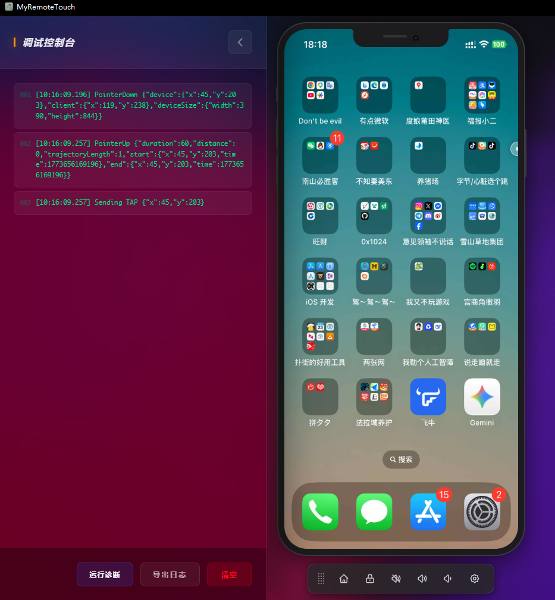

<p align="center">
  
</p>

<h1 align="center">MyRemoteTouch</h1>

<p align="center">
  <strong>Your iOS device, right at your fingertips.</strong><br />
  A high-performance iOS remote control and screen mirroring tool built with Tauri and React.
</p>

<p align="center">
  <a href="https://www.rust-lang.org/"></a>
  <a href="https://tauri.app/"></a>
  <a href="https://reactjs.org/"></a>
  <a href="LICENSE"></a>
</p>

<p align="center">
  <a href="./README_ZH.md">简体中文</a> | <strong>English</strong>
</p>

---

**MyRemoteTouch** is a specialized iOS remote collaboration tool designed for developers and power users. Utilizing low-latency video streaming and precise coordinate mapping algorithms, it allows you to fully control your iPhone or iPad directly from your computer using a mouse or trackpad.

---

## 📖 Table of Contents
- [✨ Core Features](#-core-features)
- [🏗️ Technical Architecture](#️-technical-architecture)
- [🚀 Getting Started](#-getting-started)
- [🛠️ Advanced: Developer Mode](#️-advanced-developer-mode)
- [📸 Preview](#-preview)
- [🗺️ Roadmap](#️-roadmap)
- [❓ FAQ](#-faq)
- [🤝 Contributing](#-contributing)
- [📄 License](#-license)

---

## ✨ Core Features

- 🚀 **Extreme Responsiveness**: Communicates directly over USB via the `usbmuxd` protocol, bypassing network latency for real-time mirroring.
- 🖱️ **Precise Touch**: Supports Taps, Swipes, and complex drag-and-drop gestures with pixel-perfect coordinate mapping.
- 📱 **Hardware Emulation**: Simulate physical button actions including Home, Volume Up/Down, Mute, and Screen Lock.
- 🎨 **Premium UI**: Modern glassmorphic design for an immersive and aesthetically pleasing user experience.
- 🛠️ **Developer Friendly**:
  - **Built-in Diagnostics**: One-click health check for WebDriverAgent (WDA) connection and session validity.
  - **Real-time Logging**: Magnetic debug toggle with a live console for tracking every command and response.
  - **Dockable Toolbar**: Draggable toolbar that docks to any of the four edges, automatically adjusting to your workspace.
- 📂 **Zero Configuration**: Automatically identifies connected iOS devices without the need for complex IP setups.

---

## 🏗️ Technical Architecture

- **Frontend**: React + TypeScript + Tailwind CSS (Vite)
- **Backend Core**: Rust (Tauri 2.0)
- **Communication Layer**: 
  - `idevice` (usbmuxd protocol wrapper) for port forwarding and device discovery.
  - `WebDriverAgent (WDA)` for receiving and executing control commands.
- **State Management**: Zustand (with persistent configuration).

### Architecture Overview


---

## 🚀 Getting Started

### Prerequisites
1. **iOS Device**: `WebDriverAgent` installed and running.
2. **Computer Environment**:
   - `iTunes` or `Apple Devices` service installed (for Windows users).
   - `Rust` compilation environment.
   - `pnpm` package manager.

### Build and Run
```bash
# Clone the repository
git clone https://github.com/Sinton/MyRemoteTouch.git
cd MyRemoteTouch

# Install frontend dependencies
pnpm install

# Start the development environment
pnpm tauri dev
```

---

## 🛠️ Advanced: Developer Mode

Enable **Developer Mode** in the app settings to unlock:
1. **Magnetic Debug Toggle**: Anchored to the window edge, expand it for a full-featured log console.
2. **Connection Diagnostics**: Check the health of the backend WDA services in real-time.
3. **Log Export**: Export complete operation logs with one click for troubleshooting.

---

## 📸 Preview

### Main Remote Interface


### Slide-out Developer Console


---

## 🗺️ Roadmap

- [ ] **Wireless Connection**: Support for connection over Wi-Fi.
- [ ] **Keyboard Mapping**: Custom key bindings for mobile gaming.
- [ ] **Multi-device Control**: Simultaneously control multiple iOS devices.
- [ ] **Clipboard Sync**: Shared clipboard between computer and iOS device.
- [ ] **Audio Forwarding**: Redirect iOS system audio to computer speakers.

---

## ❓ FAQ

**Q: My device is not detected?**  
A: Ensure your device is connected via a reliable USB cable and that iTunes or the Apple Devices app is running (on Windows). Also, make sure the device "Trusts" the computer.

**Q: Connection to WDA failed?**  
A: Check if WebDriverAgent is successfully launched on your iPhone and make sure you have the correct port mapping (default is 8100). You can use the built-in "Diagnostics" tool in Developer Mode to check the status.

**Q: Lagging or frozen screen?**  
A: Try decreasing the video quality or frame rate in the settings menu. High-bitrate streaming can be taxing on CPU/USB bandwidth.

---

## 🤝 Contributing

Contributions are welcome! Whether it's fixing bugs, improving UI details, or enhancing documentation.

1. Fork the Project.
2. Create your Feature Branch (`git checkout -b feature/AmazingFeature`).
3. Commit your Changes (`git commit -m 'Add some AmazingFeature'`).
4. Push to the Branch (`git push origin feature/AmazingFeature`).
5. Open a Pull Request.

---

## 📄 License

Distributed under the [MIT License](LICENSE).

---

## ❤️ Acknowledgments

Thanks to these open-source projects for providing the foundation for MyRemoteTouch:
- [Tauri](https://tauri.app/)
- [WebDriverAgent](https://github.com/appium/WebDriverAgent)
- [idevice](https://github.com/YueChen-C/idevice-rs)

---
