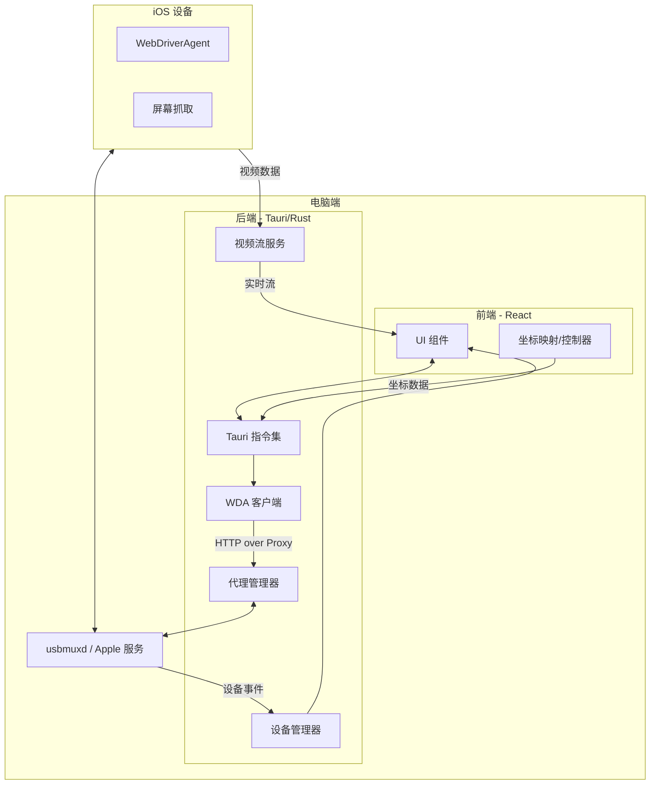

<p align="center">
  
</p>

<h1 align="center">MyRemoteTouch</h1>

<p align="center">
  <strong>让你的 iOS 设备触手可及。</strong><br />
  基于 Tauri + React 构建的高性能 iOS 远程控制与屏幕镜像工具。
</p>

<p align="center">
  <a href="https://www.rust-lang.org/"></a>
  <a href="https://tauri.app/"></a>
  <a href="https://reactjs.org/"></a>
  <a href="LICENSE"></a>
</p>

<p align="center">
  <strong>简体中文</strong> | <a href="./README.md">English</a>
</p>

---

**MyRemoteTouch** 是一个为开发者和重度用户设计的 iOS 远程协作工具。它通过极低延迟的视频流镜像和精确的坐标映射算法，让你能够直接在电脑端通过鼠标/触控板完全控制你的 iPhone 或 iPad。

---

## 📖 目录
- [✨ 核心特性](#-核心特性)
- [🏗️ 技术架构](#️-技术架构)
- [🚀 快速开始](#-快速开始)
- [🛠️ 进阶功能：开发者模式](#️-进阶功能开发者模式)
- [📸 界面预览](#-界面预览)
- [🗺️ 未来计划 (Roadmap)](#️-未来计划-roadmap)
- [❓ 常见问题 (FAQ)](#-常见问题-faq)
- [🤝 贡献指南](#-贡献指南)
- [📄 开源协议](#-开源协议)

---

## ✨ 核心特性

- 🚀 **极速响应**：基于 `usbmuxd` 协议通过 USB 链路直接通信，绕过网络延迟，实现实时镜像。
- 🖱️ **精确触控**：支持点击（Tap）、滑动（Swipe）以及复杂的拖拽手势，坐标映射精度达到像素级。
- 📱 **硬件仿真**：支持模拟物理按键操作（Home 键、音量增减、静音、锁屏）。
- 🎨 **精美 UI**：采用现代玻璃拟态（Glassmorphism）设计风格，提供沉浸式的操作体验。
- 🛠️ **开发者友好**：
  - **内置诊断面板**：一键检查 WDA（WebDriverAgent）连接状态与 Session 有效性。
  - **实时日志系统**：磁吸式调试磁贴，实时追踪每一条指令的下发与反馈。
  - **可变位置工具栏**：支持上下左右四向拖拽，自动适配屏幕空间。
- 📂 **零配置环境**：自动识别连接的 iOS 设备，无需繁琐的 IP 设置。

---

## 🏗️ 技术架构

- **前端展示**: React + TypeScript + Tailwind CSS (Vite)
- **后端核心**: Rust (Tauri 2.0)
- **通信链路**: 
  - `idevice` (usbmuxd 协议栈封装) 用于端口转发与设备监听。
  - `WebDriverAgent (WDA)` 用于接收控制指令。
- **状态管理**: Zustand (支持持久化配置)。

### 架构概览


---

## 🚀 快速开始

### 前置要求
1. **iOS 设备**: 已安装并启动 `WebDriverAgent`。
2. **电脑环境**:
   - 安装有 `iTunes` 或 `Apple Devices` 服务（Windows 用户）。
   - 安装有 `Rust` 编译环境。
   - 安装有 `pnpm` 包管理器。

### 编译与运行
```bash
# 克隆项目
git clone https://github.com/Sinton/MyRemoteTouch.git
cd MyRemoteTouch

# 安装前端依赖
pnpm install

# 启动开发环境
pnpm tauri dev
```

---

## 🛠️ 进阶功能：开发者模式

在应用“设置”中开启**开发者模式**，即可解锁：
1. **磁吸调试磁贴**：位于窗口边缘，点击展开全功能日志控制台。
2. **连接诊断**：实时查看后端 WDA 服务的健康状况。
3. **日志导出**：支持一键导出完整的操作链路日志用于排错。

---

## 📸 界面预览

### 桌面遥控主界面


### 侧滑开发者调试面板


---

## 🗺️ 未来计划 (Roadmap)

- [ ] **无线连接**: 支持通过 Wi-Fi 进行远程连接与控制。
- [ ] **按键映射**: 针对移动端游戏的自定义键盘按键映射。
- [ ] **多设备并发**: 支持同时连接并控制多个 iOS 设备。
- [ ] **剪贴板同步**: 电脑与 iOS 设备间的双向剪贴板同步。
- [ ] **音频转发**: 将 iOS 端的系统音频转发至电脑播放。

---

## ❓ 常见问题 (FAQ)

**问：无法识别到我的设备？**  
答：请确保设备已通过数据线连接，且已在设备上点击“信任此电脑”。Windows 用户请确保已安装 iTunes 或 Apple Devices 应用。

**问：WDA 连接诊断失败？**  
答：请检查设备端 WebDriverAgent 程序是否正常启动，并确保端口（默认 8100）没有被占用。你可以使用侧边调试面板自带的“运行诊断”工具排查。

**问：画面有延迟或卡顿？**  
答：请在设置菜单中尝试调低视频画质或帧率。极高分辨率的镜像可能会消耗较多的系统资源或 USB 带宽。

---

## 🤝 贡献指南

我们非常欢迎任何形式的贡献！无论是修复 Bug、改进 UI 细节，还是完善文档。

1. Fork 本仓库。
2. 创建你的特性分支 (`git checkout -b feature/AmazingFeature`)。
3. 提交你的更改 (`git commit -m 'Add some AmazingFeature'`)。
4. 推送到分支 (`git push origin feature/AmazingFeature`)。
5. 开启一个 Pull Request。

---

## 📄 开源协议

本项目基于 [MIT License](LICENSE) 协议开源。

---

## ❤️ 感谢

感谢以下开源项目为 MyRemoteTouch 提供的基石：
- [Tauri](https://tauri.app/)
- [WebDriverAgent](https://github.com/appium/WebDriverAgent)
- [idevice](https://github.com/YueChen-C/idevice-rs)

---
